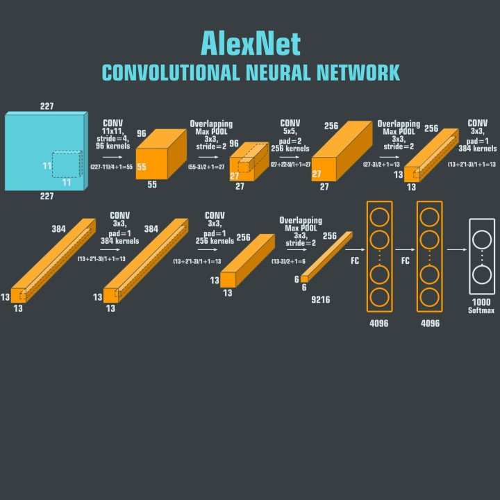
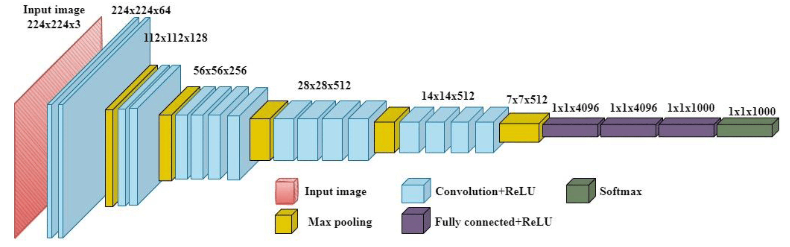
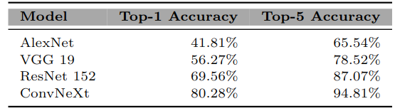
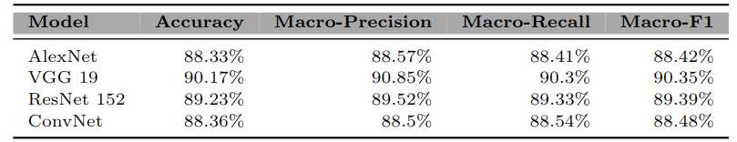
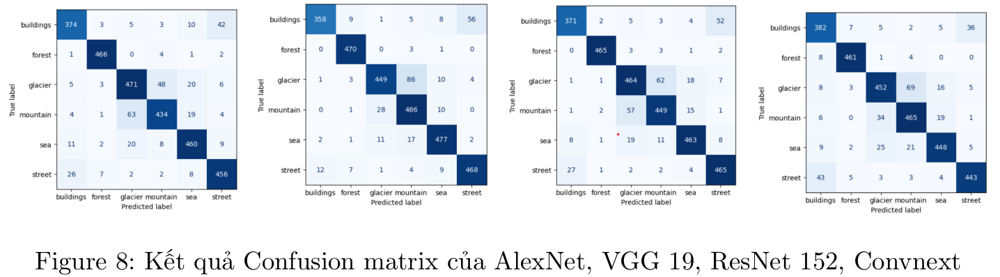
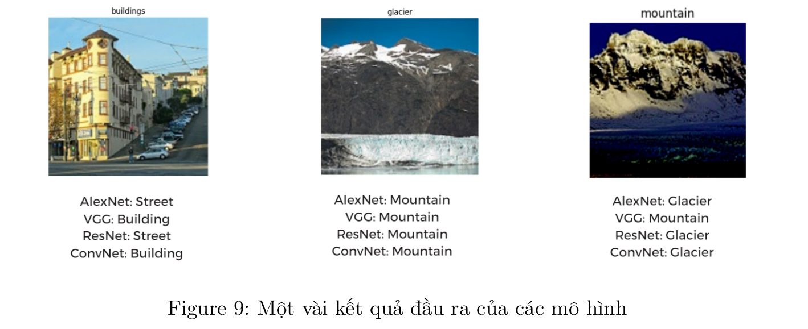

# Introduction
This repository contains some image classification model implementations (AlexNet, VGG19, ResNet152, Convnext), [report](Report.pdf) about performance of these models.

# Description
The experiments are conducted on 2 datasets [ImageNet Object Localization Challenge](https://www.kaggle.com/competitions/imagenet-object-localization-challenge/data) and [Intel Image Classification](https://www.kaggle.com/datasets/puneet6060/intel-image-classification).  
* With ImageNet dataset, because of limitation about hardware and time, the author couldn't train models that the author have implemented with train data of this dataset so that the author has used Pytorch pretrained models to predict class of images in validation data (which includes 50k images of 1000 classes (labels)). 
* With Intel dataset, the author has trained our models on training data (14034 images of 6 labels), adjusted hyper parameters using validation data (3000 images) and evaluated on test data (7000 images).  

Below is model architectures that the author have built:

|  |
|:--:|
|*AlexNet Architecture*|

| |
|:--:|
|*VGG19 Architecture*|

|  |
|:--:|
|*RestNet152 Architecture*|

|  |
|:--:|
|*ConvNeXt Architecture*|
# Result
## Result for imagenet dataset

## Resulf for intel dataset
||
|:--:|
|*Models' Performance*|

||
|:--:|
|*Confusion Matrix*|

||
|:--:|
|*Examples*|

Here is the results when set hyper-parameters as:  
* Batch-size: 64
* Learning rate: 1e-4
* Epochs: 30

## Reproduce
You can easily reproduce our results by doing following steps:
* Step 1: If you had have a Kaggle account omit this step or else you need to create one
* Step 2: Log in to kaggle, go to Setting, create new API token and download kaggle.json file to Downloads folder
* Step 3: Run these commands to create a API token that used to download dataset:
```
mkdir ~/.kaggle
cd ~/Downloads
mv kaggle.json ~/.kaggle
chmod 600 ~/.kaggle/kaggle.json // if you use linux
```
* Step 4: Clone our repository and create environment:
```
// (Optional) Create a new conda environment
conda create -n cv python=3.11
conda activate cv

// Clone and install the necessary packages
cd <folder-path>
git clone https://github.com/Tsun0193/ComputerVision-IC.git
pip install -r requirements.txt
```
* Step 5: Download datasets from ImageNet and Intel Image Classification Challenge:
```
cd <folder-path>/ComputerVision-IC
kaggle competitions download -c imagenet-object-localization-challenge
kaggle datasets download -d puneet6060/intel-image-classification
```
* Step 6: 
```
python imagenet.py // if you want to see results for imagenet dataset  
python intel.py --help // to see options when experiment with intel image classification dataset
// Eg:
python intel.py --model alexnet --seed 0 --batch 64 --learning_rate 1e-4 --epochs 30
```

# Authors
This repository was made solely by me, based on the experimental project from UETAI-Lab Handwritten Digits Recognizer.

[Duy Dang](https://github.com/Tsun0193)

# License
[MIT](https://choosealicense.com/licenses/mit/)


